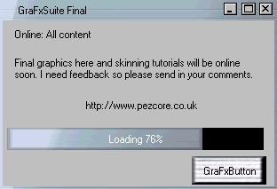



## GrafxSuite \(GUI Compoents\)

### Description

(www.pezcore for more info & skins) It boasts features such as Resizing at Runtime by the user, Easy Skinning, Interactive Min/Max-Restore/Close buttons, Form Fitting and more!

| New Features:

| GraFxConsole

(new) Icon in the top right hand corner

(new) Move the form from the control

(new) New graphics (not in screen shot)

(new) 'Mould' support to make Control 'just' like the form!

Real-time Resizing means the user can change the size of the control when and as they wish

Interactive Buttons means you can create a completely fake form which has minimize, maximize & restore & close buttons with your own code. You can also enter your own commands for clicking, double clicking and so forth on the title bar

Icon support means you can have an icon in the top right just like a normal form

Easy skinning means you can take a JPG, BMP, GIF and edit it in Paint, and simple paint package to create your own skins

Error Handling means that if there are any errors the user isn't interrupt and the control will load defaults rather than crash your program

| GraFxButton

Skinnable button with transparency

(new) Autosize to Bitmap

(new) Set Transparency colour

(new) Set On, Over, Click, Disabled Bitmaps

(new) Offset Caption & Picture

(new) Set Highlight Colour/Picture

| GraFxProgress

Skinnable progress bar

(new) Can be Bitmap or Colour

(new) Min/Max/Value settings

(new) Loading x% text & colour

(new) Font Options

(new) Event for 100% complete
 
### More Info
 

             |
---                |---
**Submitted On**   |2001-08-16 21:45:50
**By**             |[Sam Truscott](https://github.com/Planet-Source-Code/PSCIndex/blob/master/ByAuthor/sam-truscott.md)
**Level**          |Advanced
**User Rating**    |4.3 (26 globes from 6 users)
**Compatibility**  |VB 5\.0, VB 6\.0
**Category**       |[Graphics](https://github.com/Planet-Source-Code/PSCIndex/blob/master/ByCategory/graphics__1-46.md)
**World**          |[Visual Basic](https://github.com/Planet-Source-Code/PSCIndex/blob/master/ByWorld/visual-basic.md)
**Archive File**   |[GrafxSuite247768162001\.zip](https://github.com/Planet-Source-Code/sam-truscott-grafxsuite-gui-compoents__1-26269/archive/master.zip)

